# Project

* Introduction
* Project Tracking
* Entity Relationship Diagram
* Risk Assesment 
* Design
* Deployment
* Testing
* Improvements for future 

### Introduction
The aim for this project was to create a fully functioning CRUD apllication with utilisation of supporting tools, methodologies and technologies that encapsulate all core modules covered during training more specifically:
* Project Management
* Python Fundamentals
* Python Testing
* Git
* Basic Linux
* Python Web Development
* Continuous Integration
* Cloud Fundamentals
* Databases

For my project I chose to make a Pizza Delivery application that would allow the user to enter there details and order a pizza. There is 2 SQL tables one of them contains the Stock, the purpose of this table is to match the entered pizzaid and display the name of that pizza. The other table is the Orders table, the purpose of this table is to take in the customers details and what pizza number they would like to then display there order on the home page.

## Project Tracking
To track the development of my progress I used a kanban Trello Board, using a this helped me track each stage of my project and see which section i had completed or still needed working on improving my overall efficiency and not spending time trying to workout where i left off yesterday.
#### Before Completion
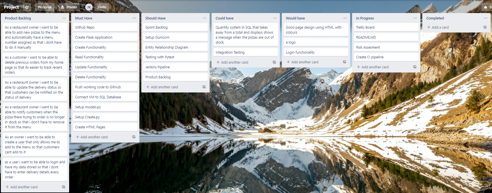
#### After Completion
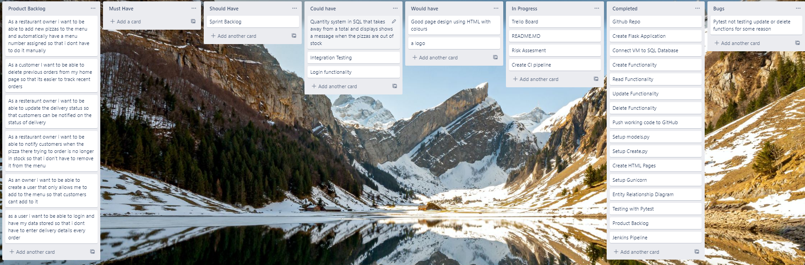

## ERD
This was my first draft of my ERD which shows the relationships and the cloumns of my SQL database
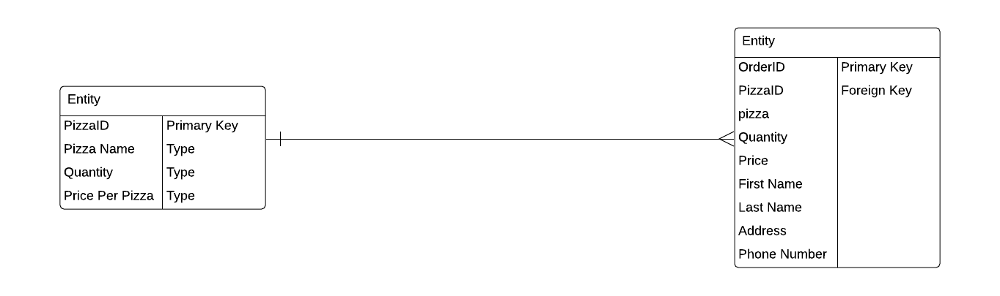
During development my entity relationship diagram changed due to time constraints some of the features I initially wanted i was unable to complete.
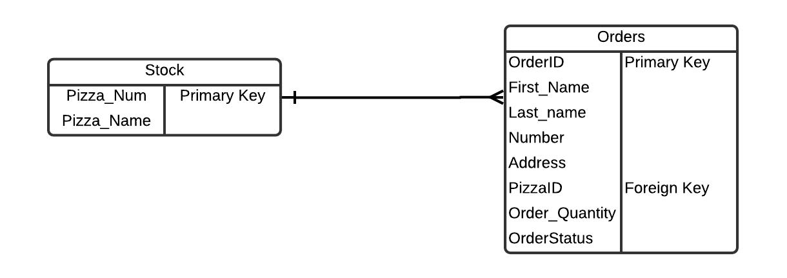

## Risk Assesment
In my risk assesment I identified some potential risks for the creation of my project 
Shown below is my initial draft for the risk assesment
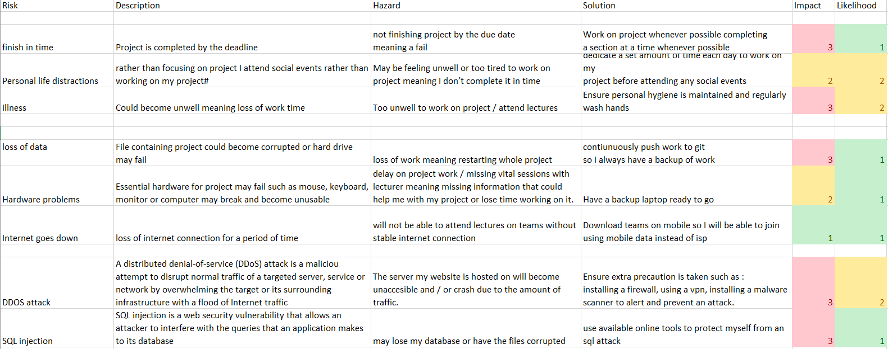

## Design
Shown below is each page of my website given more time i would like to focus more on the styling and layout of the website.
#### Home Page
Shown below is my home page this page is setup to display placed orders with entered information. It also allows the delivery status to be updated and the order to be deleted
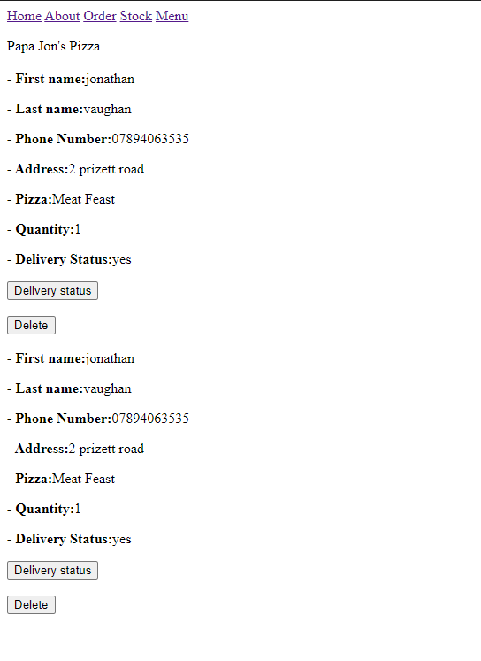
#### Stock Page
This page allows the user to add new pizza to the menu page and automatically have a menu item number assigned
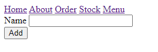
#### About Page
This is my about page where the owner could talk about the history of the pizza place and fill it with more information
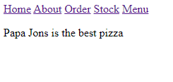
#### Menu
This page displays menu items added in from the stock page and shows the assigned menu order number
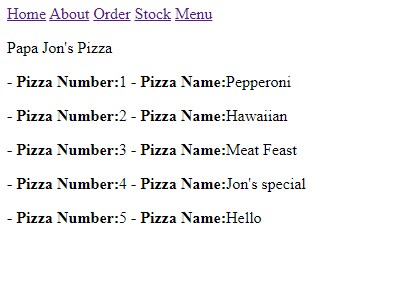
#### Order
This is where users place Orders which are then displayed on the home page
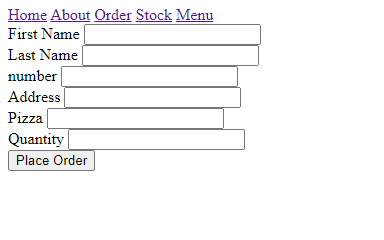
#### Delivery Status
This page can only be acccessed from the home page and allows the delivery status for the paticular order to be edited.
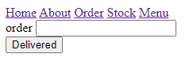

## Deployment
This Diagram shows how I setup my application  to automate software delivery process.
ci pipeline here
#### Technologies Used
* Trello: for project tracking
* Github: Version Control System, and Jenkins WebHook
* Google Cloud Platform: Virtual Machine for application and SQL Database
* Mysql: Allows creation of SQL Databases and Tables
* Jenkins: Continuous Integration Server builds application after every push to github
* PyTest: Tests code functions and offers coverage to see how much is tested
* Gunicorn: WSGI to run python web app

## Testing
Pytest was used for testing 
## Improvements for future

